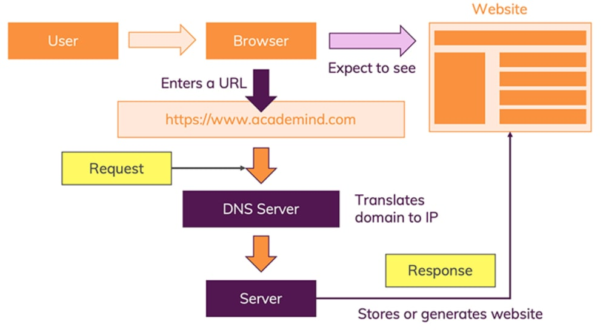

# Introductory HTML and JavaScript 

# HTML Introduction

## How websites are created

All websites use HTML and CSS, but content management systems, blogging software, ande-commerce platforms often add a few more technologies into the mix.

## How the web works

When you visit a website, the website content could be hosted anywhere in the world. in order to access the website content you need to type a URL
That URL gets resolved A Request is sent to the server of the website The response of the server is parsed The page is rendered and displayed on the user browser



# structure

## How Pages Use Structure

HTML Uses Elements to Describe the Structure of Pages To describe the structure of a web page. 

```<html>
<body>
<h1>This is the Main Heading</h1>
<p>This text might be an introduction to the rest of
the page. And if the page is a long one it might
be split up into several sub-headings.<p>
<h2>This is a Sub-Heading</h2>
<p>Many long articles have sub-headings so to help
you follow the structure of what is being written.
There may even be sub-sub-headings (or lower-level
headings).</p>
<h2>Another Sub-Heading</h2>
<p>Here you can see another sub-heading.</p>
</body>
</html>
```
### Basic sections of the web page

#### The `<html>` tag

The `<html>` element is a container for metadata (data about data) and is placed between the `<html>` tag and the <body> tag. `<title>` goes inside the `<html>` element.

#### The `<body>` tag

the `<body>` tag indicates that every thing goes inside it will appera on the web Page.

#### `<h1>` to `<h6>`

these tags are used to define HTML headings.

# Extra Markup

## DOCTYPES

DOCTYPE declaration is used to tell the web browser which version of HTML the page is using (although browsers usually display the page even if it is not included).

### HTML 5
`<!DOCTYPE html>`
 

### HTML 4
```<!DOCTYPE html PUBLIC
"-//W3C//DTD HTML 4.01 Transitional//EN"
"http://www.w3.org/TR/html4/loose.dtd">
```

## Comments in HTML

`<!-- -->`

If you want to add a comment to your code that will not be visible in the user's browser, you can add the text between these characters:
`<!-- comment goes here -->`

## ID Attribute
The id attribute defines an identifier which must be unique in the whole document. Its purpose is to identify the element when linking scripting, or styling (with CSS).

## Class Attribute

The class attribute is often used to point to a class name in a style sheet. It can also be used by a JavaScript to access and manipulate elements with the specific class name.

# HTML5 Layout

HTML5 includes a set of markup elements that overcome this difficulty. These new elements have meaningful names so that just by looking at these elements you get a clear idea about their content. These semantic elements of HTML5 are listed below (this is not an exhaustive list):

- `<header>`
- `<footer>`
- `<section>`
- `<article>`
- `<aside>`
- `<nav>`

# Process & Design

## Who is the Site For?

Every website should be designed for the target audience—not just for yourself or the site owner. It is therefore very important to understand who your target audience is.

## Why People Visit YOUR Website

Now that you know who your visitors are, you need to consider why they are coming. While some people will simply chance across your website, most will visit for a specific reason.

## What Your Visitors are Trying to Achieve

It is unlikely that you will be able to list every reason why someone visits your site but you are looking for key tasks and motivations. This information can help guide your site designs.


# The ABC of Programming

## How JavaScript makes web pages more Interactive

- ACCESS CONTENT
You can use JavaScript to select any element, attribute, or text from an HTML page

- MODIFY CONTENT
You can use JavaScript to add elements, attributes, and text to the page, or remove them.

- PROGRAM RULES
You can specify a set of steps for the browser to follow (like a recipe), which allows it to access or change the content of a page.

- REACT TO EVENTS
You can specify that a script should run when a specific event has occurred.

for example: when you click a button 

Being able to change the content of an HTML page while it is loaded inthe browser is very powerful. The examples below rely on the ability to: Access the content of the page
Modify the content of the page Program rules or instructions the browser can follow React to events triggered by the user or browser