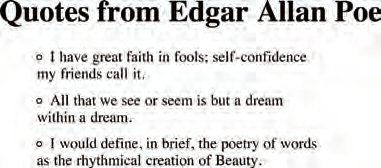

# Web Forms

## Why Forms?

enabling users to search, allow users to perform other functions online. You will see forms when registering as a member of a website, when shopping online, and when signing up for newsletters or mailing lists.

## Form Controls

There are several types of form controls that
you can use to collect information from visitors
to your site.

- ADDING TEXT:

- Making Choices:

- Submitting Forms:

- Uploadi ng Files:


## How Forms Work


A user fills in a form and then presses a button to submit the information to the server.


## Form Structor


```
<form action="http://www.example.com/subscribe.php"
method="get">
<p>This is where the form controls will appear.
</p>
</form>
```

`<form>`
Form controls live inside a `<form>` element. This element should always carry the action
attribute and will usually have a method and id attribute too.
### action
Every `<form>` element requires an action attribute. Its value is the URL for the page on the server that will receive the information in the form when it is submitted.
### method
Forms can be sent using one of two methods: get or post. With the get method, the values from the form are added to the end of the URL specified in the action attribute.


# Lists, Tables and Forms

list-style

As with several of the other CS properties, there is a property that acts as a shorthand for list styles. It is called list-style, and it allows you to express the markers' style, image and position properties in any order.


```
<h1>Quotes from Edgar Allan Poe</h1>
<ul>
<li> I have great faith in fools; self-confidence
my friends call it.</li>
<li>All that we see or seem is but a dream within
a dream.</li>
<li>I would define, in brief, the poetry of words
as the rhythmical creation of Beauty.</li>
</ul>
```

```
ul {
list-style: inside circle;
width: 300px;}
li {
margin: 10px 0px 0px 0px;}
```




# JavaScrip Events


Here is a selection of the events that occur in the browser while you are browsing the web. Any of these events can be used to trigger a function in your JavaScript code.

UI EVENTS Occur when a user interacts with the browser's user interface (UI) rather than the web page
EVENT DESCRIPTION

|  EVENT	|   DESCRIPTION	|
|---	|---	|
|   load	|   Web page has finished loading	|   	
|   unload	|   Web page is unloading (usually because a new page was requested)	| 
|   error	|   Browser encounters a JavaScript error or an asset doesn't exist	|   	
|   resize	|   Browser window has been resized	| 
|   scroll	|   User has scrolled up or down the page	| 